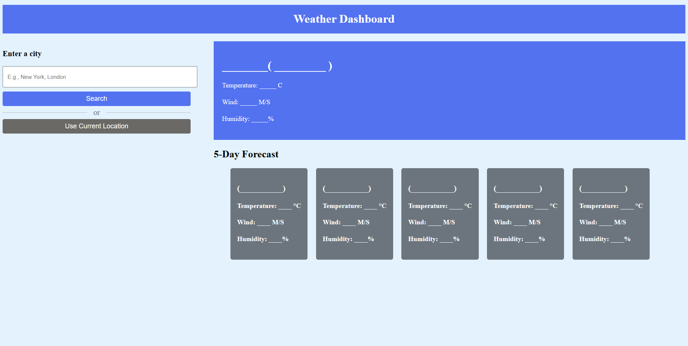
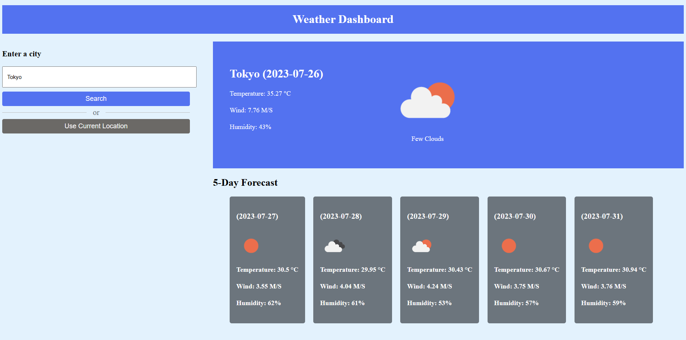
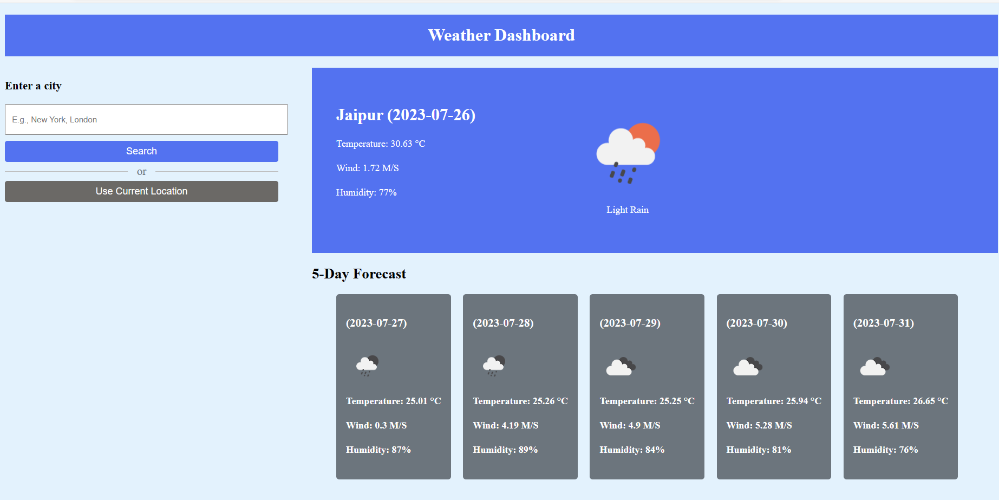
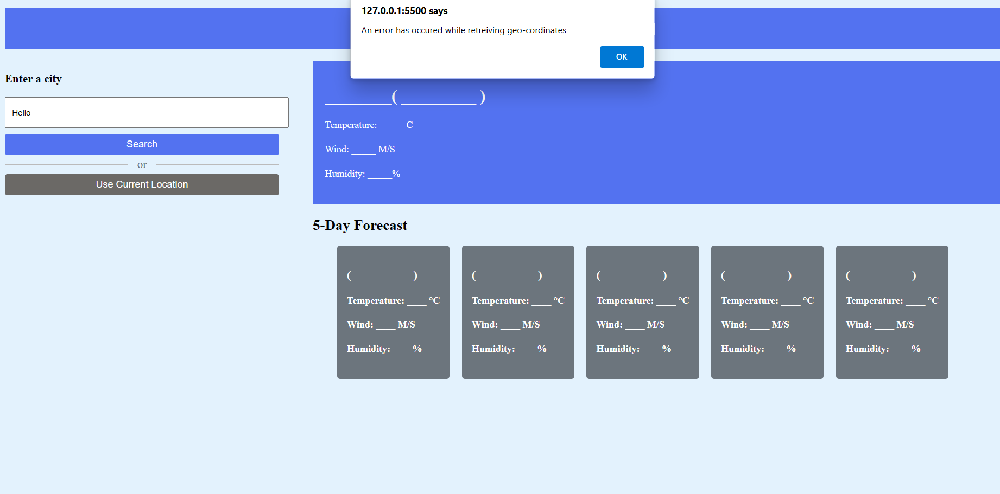

## Weather Application

This project is a simple web application that displays the weather information for a given location using the OpenWeather API. The application is built using HTML, CSS, and JavaScript, allowing users to search for the weather of a specific city or location. There is also a feature for getting information about your area in a single tap. It used two modules of OpenWeather API: **Current Weather Data** and **5 Day / 3 Hour Forecast** where the first module gives application data by city name i.e. its longitude and latitude which can be used by the second module to get forecasting for new 5 days.

### Built With

* HTML & CSS
* Javascript
* OpenWeatherMap API

## How to Run

- To run this application, you will need an API key from OpenWeather API. You can sign up for a free account and obtain an API key from their website 
  (https://openweathermap.org/api).
- To get a local copy up and running, just Clone the repo
   ```
   git clone https://github.com/gauravkumar14598/Weather_api.git
   ```
- You need to replace the placeholder API_KEY in the JavaScript code with your actual API key.
- Open the cloned folder in VSCode and fire up the Local Development server using [Live Server extension](https://marketplace.visualstudio.com/items?itemName=ritwickdey.LiveServer).

- ## Screenshots

Check Screen               |  City Weather
:-------------------------:|:-------------------------:
||

Location Weather           |  Alerts       
:-------------------------:|:-------------------------:
||


## Features
- Display the current weather conditions, including temperature, weather description, humidity, and wind speed.
- Show a relevant weather icon representing the current weather conditions.
- Convert the temperature between Celsius and Fahrenheit.
